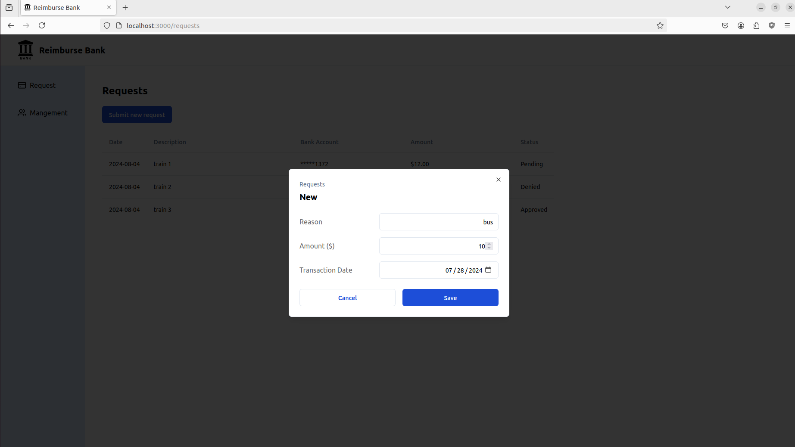
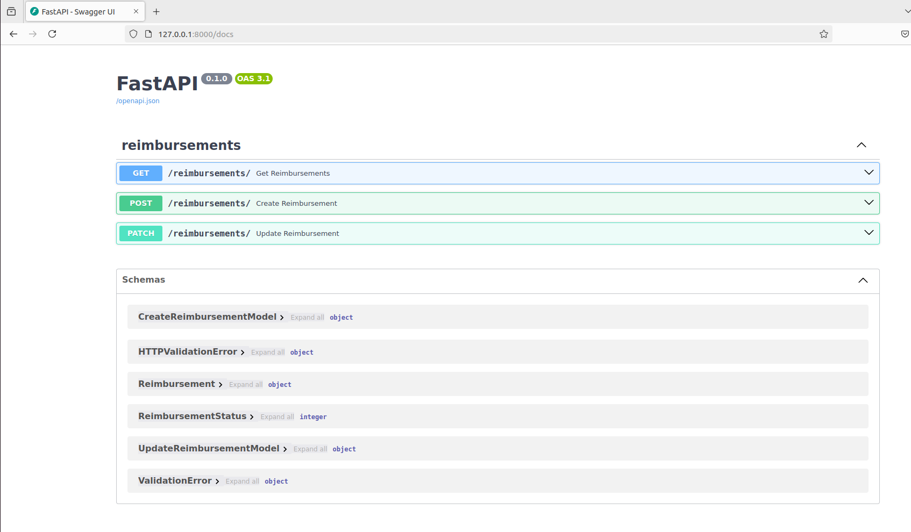

# Welcome to Reimburse
This is a quick project to demonstrate FastAPI and Next.js usage. It's a bank project that currently only implements reimbursements for one bank with random account numbers. Each section was time-limited. It has minimal testing and validations.

The intructions written for how to run this project assume that the entire repository has been cloned/pulled down so that the code is accessible.

Please note that the frontend is not fully functioning without the backend running simulatenously. Please run the two parts through separate terminals.

## Backend
Please see [backend/README.md](./backend/README.md) for how to use the backend program.

## Frontend
Please see [frontend/README.md](./frontend/README.md) for how to use the frontend program.

## Example Screenshots

### Homepage

### Requests Page

### New Reimbursement Dialog

### Mangement Page

### Filtered Management Page

### Update Reimbursement Dialog

### Interactive API Documentation

### Alernative API Documentation (not interactive)

